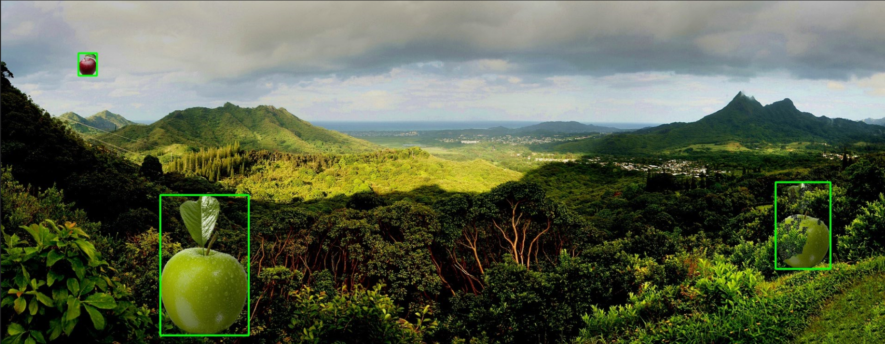
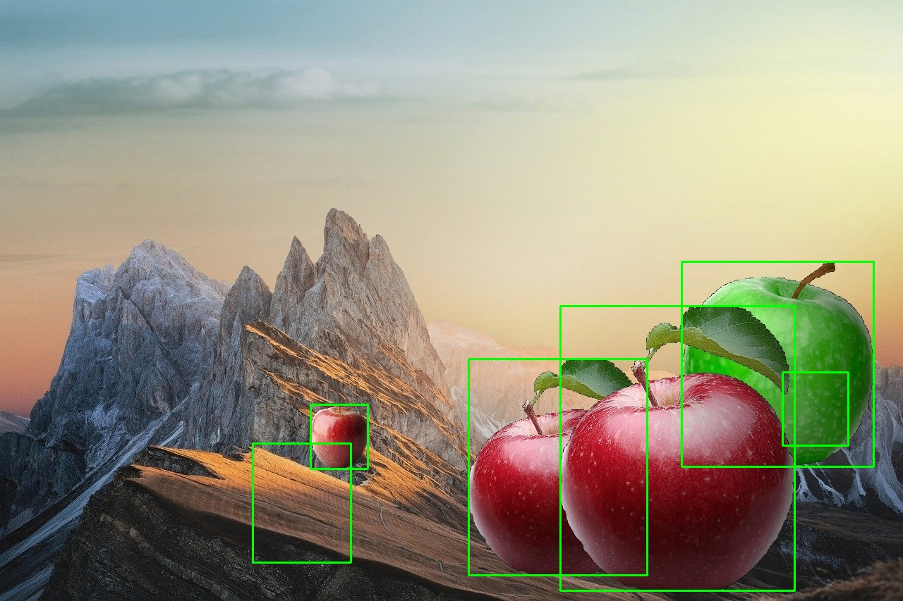

# apple-incrustation

## Purpose of this project

Object detection algorithms, such as yolo, are models that needs a lot of samples in order to train properly. And generate those datas is pretty long, data labellization requires a lot of people and is still done by human hand.

This project's purpose is to reduce the part attribute to this human hand and to automatically create a dataset using objects and backgrounds.

It will incrust the objects in the backgrounds and try to mimic a realistics photography. While incrusting the objects, the algorithm will store the area where all the objects are incrusted and write those values in a file along with the generated image. Finnally, we obtain a dataset of labellized images and the file that store the coordinates of our incrusted objects.

## Setup

The project is used through the script incrust.py runned in a terminal. To install the project, simply clone it via `git clone <https://github.com/Menchit-ai/apple-incrustation>`. Then go to the folder and install the dependencies via `pip install -r requirements.txt`. If the installation finished properly, the script is ready to be used.

## How to use it

To run the script, open a terminal in the folder that contains the project and type for example : `python incrust.py ./xbackground ./xobjects 50`, this command will create 50 images using the backgrounds and the objects that are respectively in the folders xbackground and xobjects. You can use your own folder by simply replace those folders by the path to your personnal ones. By default, it will create a folder **output** and a folder **proof** and store the created images in them. If there was already a folder output or proof, there content will be **deleted**.

### Options

You can add 3 optionnal parameters :

- `-i` or `--iteration` is used to specify how many objects you want to be, at most, incrusted in each images. The algortihm will incrust a random number between 1 and the number that you specified in each image. **By default** it will incrust only one object.
- `-d` or `--depth` is used to specify how many depths you want to put in the background image. The image will be divide in the number of depth that you specified. The greater the value is, the omre you can obtain weird depth and have weird looking incrustations. **By default** the value is 4.
- `-o` or `--output` is used to specify the path of the output folder. The output folder is where all the generated images will be stored. **By default** the value is *./output*.
- `-p` or `--proof` is used to specify the path of the proof folder. The proof folder is where the images with boxes will be stored. The images with boxes are images where rectangle are drawn using the .txt file that contains the coordonates of the incrusted objects. Those images are usefull if you want to check if the algorithm worked properly and to find mistakes or bugs.

## Limitations

- First the light estimation used to adjust our images is not perfect and cannot be used if the light source in directly in the image. It also assumes that the light is comming from above and not from under the object.
- The algorithm can still be optimized by removing some computation espacially in the case when we want to generate less images than we have in our background folder.
- The incrusted apples can be hidden behind objects or behind other apples but the algorithm will still write the full coordinates of the apples even though they are not visible. This means that we can obtain apple where there is only a wall or another apple.
- Finally, the objects that will be incrusted must be on a black background (or transparent background) because the algorithm use masks that take all non black pixels. So if the beackground is green, the algorithm will incrust the green along with the object.

## Results

Using this script with iteration set at 7 and depth at 8 I can obtain 100 images in 175 seconds.
Some results are pretty good and useable. But Sometimes, an apple can be hidden behind another or totally hidden behind some part of the background, this can lead to a bad training of a yolo that use this generated dataset. Correct this kind of problem is a first step to make those generated dataset usable. For now the light part can still be upgrade by obtaining a more precise algorithm and one that can be used even if the light source is inside the image. The depth effect is pretty good and could be tested with other type of model.

Hidden apple : 
Depth effect : 

## Ways of improvement

- Find a more precise way to approximate the light direction in the image.
- Handle the case when the light source is in the image.
- Generate more advanced light mask (not just light and dark circles), maybe lasks that depends on the object's shape.
- Write algorithm that can extract an object from it background so we do not have to set the background to black manually.
- Test new models that extract depths in 2D images and find which one is the best and why.
